# Rxn Bench - DIY Automated Chemistry Bench

## Table of Contents

- [Overview](#overview)
- [Navigating this repository](#navigating-this-repository)
- [Requirements](#requirements)
- [Usage](#usage)
- [Implementation and design](#implementation-and-design)
- [Gallery](#gallery)
- [References and helpful material](#references-and-helpful-material)
- [Authors and Contributors](#authors-and-contributors)

## Overview

Rxn Bench is a DIY automated chemistry bench built on a repurposed Sovol SV08 3D printer, with an Atlas Scientific probe for pH sensing. A Raspberry Pi on the printer runs Klipper/Moonraker plus SiLA2 device servers for the gantry and pH sensor. A separate operator machine runs the Rxn Bench<!-- TODO: link to the Rxn Bench repo once it's split into its own submodule --> desktop app, which talks to those servers over gRPC/SiLA, and experiment scripts can drive the bench directly through the Rxn Bench Client<!-- TODO: link to the Rxn Bench Client repo once it's split into its own submodule --> Python API.

### Motivation

Manual sampling is slow and inconsistent, which makes it a bad fit for data-hungry methods like ML and high-throughput screening. Commercial lab automation fixes that, but it typically costs tens of thousands of dollars and locks you into one vendor's hardware. Rxn Bench is a cheaper, open alternative: off-the-shelf parts, 3D-printed labware, and an open software stack, for around $1000.

## Navigating this repository

- [`rxnbench/`](rxnbench/) - app code that isn't specific to one device: `frontend/` (the desktop UI shell, discovery, device selection, generic fallback UI) and `backend/` (the uv workspace root, the shared `client/` Python API, install scripts).
- [`devices/`](devices/) - one self-contained plugin per physical device (`gantry`, `ph_sensor`, `camera`, `dosing_pump`), each split into a `capability/` (the SiLA2 server + operator-UI widget - hardware-agnostic) and a `driver/` (the actual vendor hardware code that plugs into it, plus that hardware's CAD and any mount/toolhead config). See [Supported-Devices.md](Supported-Devices.md) for which driver backs which capability. A device folder can be dropped in or removed without touching the app shell.
- [`hardware_models/`](hardware_models/) - placeholders for future devices without hardware yet. Each existing device's CAD lives with its driver instead - see `devices/<name>/driver/hardware_models/`.
- [`repo-assets/`](repo-assets/) - images used throughout this README.
- [`notes/`](notes/) - working notes.

See [.claude/CURRENT_STATE.md](.claude/CURRENT_STATE.md) for the full architecture snapshot, package layout, and active design decisions.

## Requirements

- A Sovol SV08 3D printer (or similar Klipper-based motion platform) and a computer device (__e.g. a Raspberry Pi 5__) to control it
- Python 3.10+ and [`uv`](https://docs.astral.sh/uv/) on both the Pi (backend) and the operator machine (frontend)
- Atlas Scientific EZO pH kit and 3D-printed mounts (see Component List below) for pH sensing hardware

## Usage

See [USAGE.md](USAGE.md) for commands to install dependencies and start the backend servers (real or mocked) and the frontend UI.

## Implementation and design

### Capability-based hardware abstraction

Each instrument is exposed as a SiLA2 feature server on a backend computer (e.g., a Raspberry Pi): a gantry capability, a pH sensor capability, a pump capability, etc. New hardware plugs into the same feature interface, so a device can be swapped or added with minimal frontend and backend changes - if it walks like a duck and talks like a duck, it's treated as a duck.

### Desktop control + Python API

Rxn Bench<!-- TODO: link to the Rxn Bench repo once it's split into its own submodule --> is a desktop app for direct device control, and Rxn Bench Client<!-- TODO: link to the Rxn Bench Client repo once it's split into its own submodule --> is a Python API for headless scripting. Both talk to the same device servers, so nothing about a script needs a special "automation-only" code path.

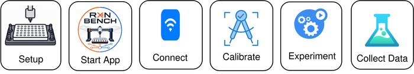

### Component List

#### Motion Platform

| Name            | Link                                                                                                                                                                         | Purpose                                                |
| --------------- | ---------------------------------------------------------------------------------------------------------------------------------------------------------------------------- | ------------------------------------------------------ |
| SV08 3D Printer | [MatterHackers](https://www.matterhackers.com/store/l/sovol-sv08-enclosed-pre-assembled-3d-printer/sk/MQ7MC2AK?rcode=PMAX_GENPOP3DP&gad_source=1&gad_campaignid=20506454105) | XYZ motion platform base for liquid handler automation |
| Raspberry Pi 5  | [PiShop](https://www.pishop.us/product/raspberry-pi-5-8gb/?src=raspberrypi)                                                                                                  | Main controller for coordinating motion and sensors    |

#### pH Sensor

| Name                              | Link                                                                                                           | Purpose                                                                                             |
| --------------------------------- | -------------------------------------------------------------------------------------------------------------- | --------------------------------------------------------------------------------------------------- |
| Atlas Scientific EZO Micro pH Kit | [Atlas Scientific](https://atlas-scientific.com/kits/micro-ph-kit/)                                            | Complete kit for pH measurement                                                                     |
| Atlas Scientific EZO pH Circuit   | [Atlas Scientific](https://atlas-scientific.com/embedded-solutions/ezo-ph-circuit/)                            | Embedded pH signal processing circuit                                                               |
| pH Isolation Board                | [Atlas Scientific](https://atlas-scientific.com/carrier-boards/electrically-isolated-ezo-carrier-board-gen-2/) | Electrically isolates pH circuit to prevent noise/interference                                      |
| Half-Cell pH Isolation Board      | [Atlas Scientific](https://atlas-scientific.com/carrier-boards/half-cell/)                                     | Carrier board for half-cell pH probe configurations                                                 |
| Spear Tip pH Probe                | [Atlas Scientific](https://atlas-scientific.com/probes/spear-tip-ph-probe/)                                    | Soil/spear-tip combination electrode; male SMA connector, mates directly to isolation carrier board |

#### Labware

##### Workspace

A workspace is a YAML-defined deck layout ([`devices/gantry/capability/backend/src/rxn_bench_gantry/workspace/`](devices/gantry/capability/backend/src/rxn_bench_gantry/workspace/)) that tells the gantry backend which labware sits where: sample plates, wash/waste beakers, a calibration station, and the washing station can all be mixed in whatever arrangement fits the deck and the experiment. Swapping workspaces (or editing one in the desktop UI's workspace editor) is a config change, not a rebuild - see [USAGE.md](USAGE.md) for how to load one.

##### Sample-Plates

3D-printed plate/tube holders that snap onto the deck's footprint grid. Each is a YAML labware definition under [`devices/gantry/capability/backend/src/rxn_bench_gantry/labware/`](devices/gantry/capability/backend/src/rxn_bench_gantry/labware/), the single source of truth for well geometry, plate height, and the gantry's clearance/engagement-depth math.

| Name                           | Wells | Purpose                           |
| ------------------------------ | ----- | --------------------------------- |
| 96-Well Standard Plate         | 8x12  | High-density standard well plate  |
| 24-Well Standard Plate         | 4x6   | Square-well standard plate        |
| 24-Well Sample Holder (5 mL)   | 4x6   | Holds 5 mL vials                  |
| 24-Well Sample Holder (15 mL)  | 4x6   | Holds 15 mL vials                 |
| 15-Well Sample Holder          | 3x5   | Holds large-format samples        |
| 6-Well Sample Holder (25 mL)   | 2x3   | Holds 25 mL vials                 |
| 6-Well Sample Holder (50 mL)   | 2x3   | Holds 50 mL vials                 |
| 3-Well Sample Holder           | 1x3   | Holds large-diameter samples      |
| 100 mL Beaker Holder           | 1x1   | Wash/waste reservoir              |

##### Footprints

Every piece of labware shares the same footprint (127.76 x 85.48 mm - the ANSI/SBS standard microplate footprint), so any plate, tube holder, beaker, or the washing station locks into the same modular grid of mounting tiles on the deck. Swapping a 6-well tube rack for a 96-well plate is a matter of physically swapping footprints and pointing the workspace YAML at the new labware, not redesigning the deck.

##### Washing-Station

A 3D-printed cup, routed to waste through tubing, used to rinse the pH probe (or future pipette tips) between wells. It is defined as its own labware footprint ([`washing_station.yaml`](devices/gantry/capability/backend/src/rxn_bench_gantry/labware/washing_station.yaml)) so it slots into a workspace exactly like any other plate.

###### Liquid Handler (In-progress)

| Name                    | Link                                                                                                              | Purpose                                                |
| ----------------------- | ----------------------------------------------------------------------------------------------------------------- | ------------------------------------------------------ |
| Pipette Cone Assembly   | [PipetteSupplies](https://www.pipettesupplies.com/product/e1-clip-tip-tip-cone-assembly-single-channel-1250-l-t/) | Actual liquid displacement mechanism                   |
| Stepper Linear Actuator | [Haydon Kerk Pittman](https://www.haydonkerkpittman.com/products/linear-actuators/can-stack-stepper)              | Pushes the pipette plunger to aspirate/dispense liquid |

#### Extra Peripherals

| Name                              | Link                                                                       | Purpose                                                                   |
| --------------------------------- | -------------------------------------------------------------------------- | ------------------------------------------------------------------------- |
| SMA Male-to-Female Extender Cable | [Atlas Scientific](https://atlas-scientific.com/accessories/sma-extender/) | Extends the probe cable reach from the carrier board to the mounted probe |

#### Other components/items

| Name         | Link                                       | Purpose                                             |
| ------------ | ------------------------------------------ | --------------------------------------------------- |
| Bambu Lab A1 | [BambuLabs](https://bambulab.com/en-us/a1) | Unmodified used to 3D print platforms, plates, etc. |

## Gallery

### Assembled bench

| Assembled, pipette over a well plate                                                                                     | Running on the bench next to the operator laptop                                                                                     |
| ------------------------------------------------------------------------------------------------------------------------ | ------------------------------------------------------------------------------------------------------------------------------------ |
| 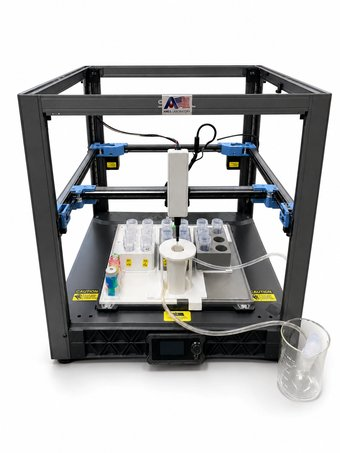 | 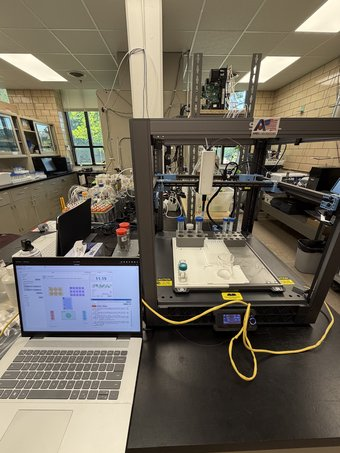 |

### pH probe toolhead

CAD design next to the assembled 3D-printed housing around the Atlas Scientific EZO pH circuit and probe.

| CAD design                                                                                                                        | Assembled                                                                                        |
| --------------------------------------------------------------------------------------------------------------------------------- | ------------------------------------------------------------------------------------------------ |
|  | 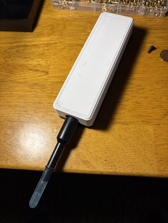 |

### Toolhead docking mount

The gantry docks multiple toolheads via a 3D-printed mount with linear-rails, in the spirit of the tool-changer designs linked below.

| CAD design                                                                                                       | Assembled                                                                                       |
| ---------------------------------------------------------------------------------------------------------------- | ----------------------------------------------------------------------------------------------- |
| 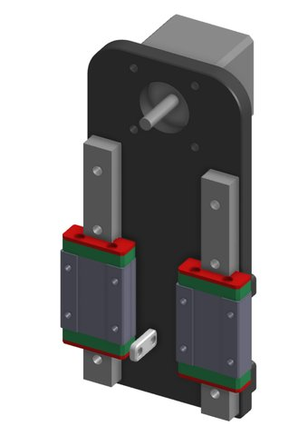 | 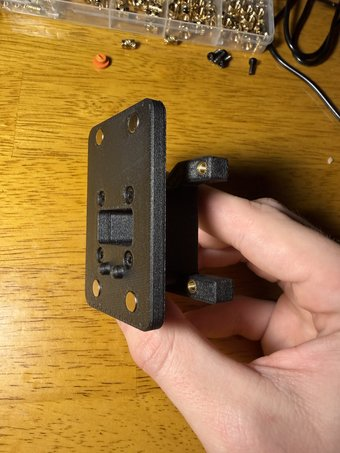 |

### Labware

#### Workspace

| Planned layout                                                                                                                                                                                               | Assembled deck                                                                                                                                          |
| ------------------------------------------------------------------------------------------------------------------------------------------------------------------------------------------------------------ | ------------------------------------------------------------------------------------------------------------------------------------------------------- |
| 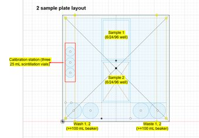 | 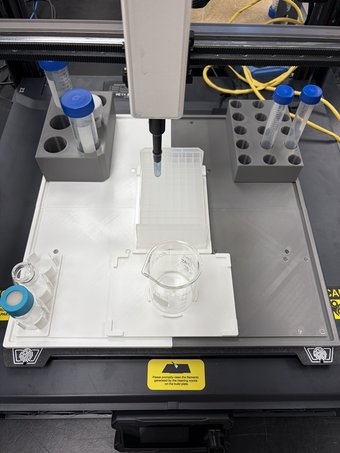 |

#### Sample-Plates

| 24-Well Sample Holder                                                                                  | 15-Well Sample Holder                                                                                         |
| ------------------------------------------------------------------------------------------------------ | ------------------------------------------------------------------------------------------------------------- |
|  | 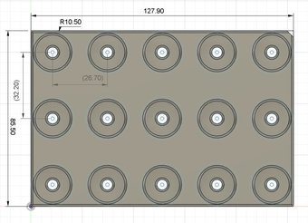 |

#### Footprints

#### Washing-Station

### Rxn Bench UI

#### Main interface

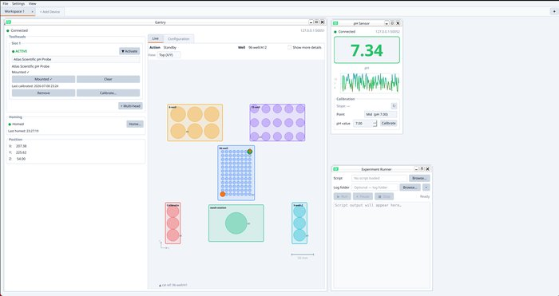

#### Sensor and control widgets

| Gantry                                            | pH Probe                                              | Experiment Runner                                                       |
| ------------------------------------------------- | ----------------------------------------------------- | ----------------------------------------------------------------------- |
| 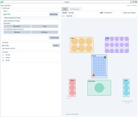 |  |  |

#### Adding a device

## References and helpful material

### Core

- [How to convert a 3D printer to a personal automated liquid handler for life science workflows](https://www.sciencedirect.com/science/article/pii/S2472630324001213#bib0043)
- [Opentrons](https://opentrons.com/) - commercial lab-automation platform, referenced for cost/rigidity comparison
- [SILA Standard](https://sila-standard.com/standards/)
- [SILA Standard GitLab](https://gitlab.com/SiLA2)
- [Klipper Firmware](https://www.klipper3d.org/)
- [SOVOL SV08 GitHub](https://github.com/Sovol3d/SV08)
- [Raspberry Pi Docs](https://www.raspberrypi.com/documentation/computers/raspberry-pi.html)
- [Crowsnest](https://docs.mainsail.xyz/crowsnest/)
- [Moonraker](https://moonraker.readthedocs.io/en/latest/)
- [Pipette Clip Tip](https://www.thermofisher.com/us/en/home/life-science/lab-plasticware-supplies/pipettes-pipette-tips/pipette-tips/products/cliptip-pipette-system.html)

### Related open-source lab automation projects

- [Rxn Rover](https://rxnrover.github.io/) - Ames National Lab Automation Platform
- [Science Jubilee](https://science-jubilee.readthedocs.io/) - open-source tool-changing lab robot with pipette, camera, and sensor tools
- [Jubilee: An Extensible Machine for Multi-tool Fabrication (paper)](https://www.researchgate.net/publication/341697828_Jubilee_An_Extensible_Machine_for_Multi-tool_Fabrication)
- [Automated Liquid Handler from a 3D Printer - Journal of Chemical Education](https://pubs.acs.org/doi/10.1021/acs.jchemed.3c00855)
- [E3D Tool Changer R&D](https://e3d-online.com/blogs/news/research-and-development-motion-system-and-tool-changer) - commercial tool-changer that inspired Jubilee's docking mechanism
- [GitHub - totaldesaster/toolchanger](https://github.com/totaldesaster/toolchanger) - low-cost 3D-printed tool changer mechanism
- [EvoBot: Open-Source Modular Liquid Handling Robot](https://www.mdpi.com/2076-3417/10/3/814)
- [Open-source personal pipetting robots (Nature Communications)](https://www.nature.com/articles/s41467-022-30643-7)

## Authors and Contributors

- __John Brittain__ - software, system design, hardware, project lead
- __Felisha Kuo__ - experimental setup, lab workflows, chemistry integration lead
- __David Lee__ - lab support and equipment
- __Lun An__ - chemistry supervision and review
- __Long Qi__ - project sponsorship and direction
- __Zachery Crandall__ - engineering/software supervision and review

Built during the [SULI internship program](https://science.osti.gov/wdts/suli) at [Ames National Laboratory](https://www.ameslab.gov/).
