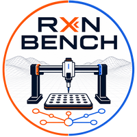
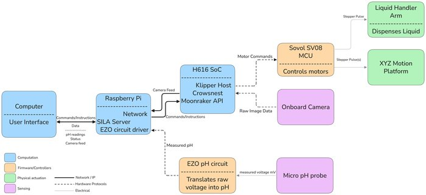
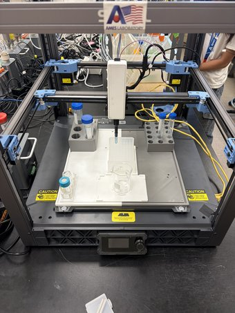
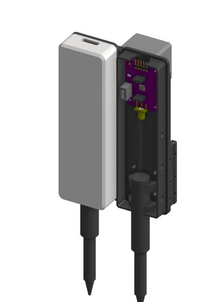
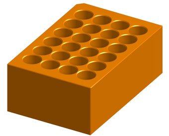
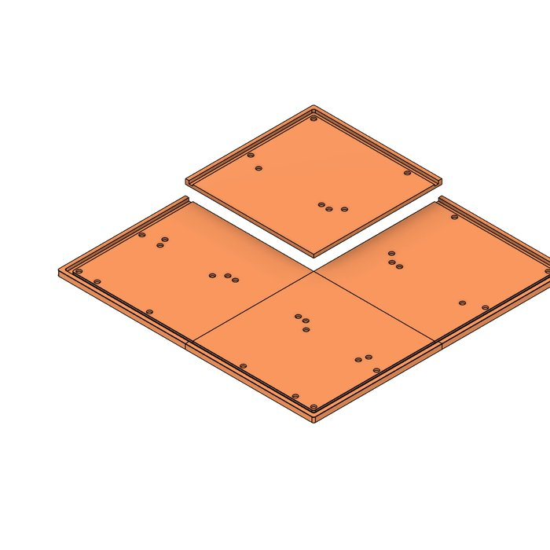
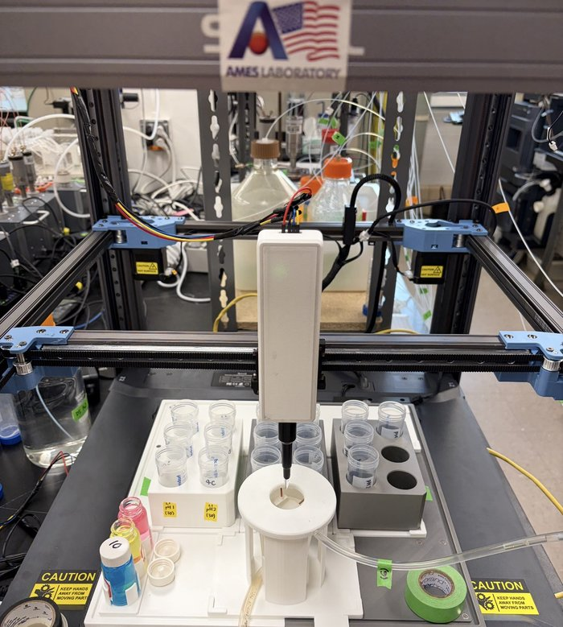
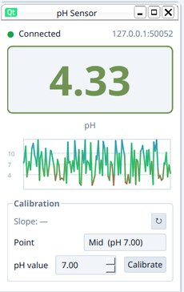
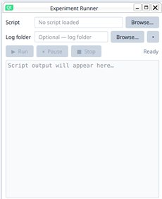
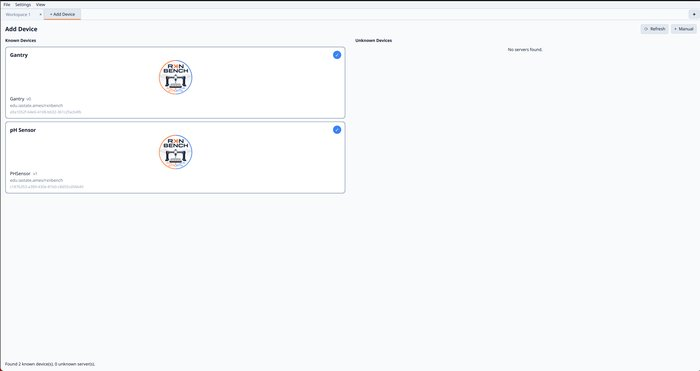

# Rxn Bench - DIY Automated Chemistry Bench

## Table of Contents

- [Overview](#overview)
- [Navigating this repository](#navigating-this-repository)
- [Requirements](#requirements)
- [Usage](#usage)
- [Implementation and design](#implementation-and-design)
- [Gallery](#gallery)
- [References and helpful material](#references-and-helpful-material)
- [Authors and Contributors](#authors-and-contributors)

## Overview

Rxn Bench is a DIY automated chemistry bench built on a repurposed Sovol SV08 3D printer as the XYZ motion platform, with an Atlas Scientific probe for pH sensing. A Raspberry Pi on the printer runs Klipper/Moonraker plus SiLA2 device servers for the gantry and pH sensor; a separate operator machine runs a frontend application [Rxn Bench](TODO: Eventually include repo link) that talks to those servers over gRPC/SiLA, and experiment scripts drive the bench through a Python client [Rxn Bench Client](TODO: Eventually include repo link).

### Motivation

Machine learning, high-throughput screening, and AI-assisted discovery all depend on large, reliable experimental datasets, and generating that data by hand is slow, inconsistent, and labor-intensive. Commercial automation platforms solve the repeatability problem, but most are costly, specialized, and locked to specific hardware and workflows - out of reach for many labs. Rxn Bench is a low-cost, modular alternative: off-the-shelf hardware, open lab-software frameworks, and customizable 3D-printed components, letting a lab integrate diverse devices, adapt workflows, and generate data at scale for under $1000.

## Navigating this repository

- [`rxnbench/`](rxnbench/) - app code that isn't specific to one device: `frontend/` (the desktop UI shell, discovery, device selection, generic fallback UI) and `backend/` (the uv workspace root, the shared `client/` Python API, install scripts).
- [`devices/`](devices/) - one self-contained plugin per physical device (`gantry`, `ph_sensor`, `camera`, `dosing_pump`), each split into a `capability/` (the SiLA2 server + operator-UI widget - hardware-agnostic) and a `driver/` (the actual vendor hardware code that plugs into it, plus that hardware's CAD and any mount/toolhead config). See [Supported-Devices.md](Supported-Devices.md) for which driver backs which capability. A device folder can be dropped in or removed without touching the app shell.
- [`hardware_models/`](hardware_models/) - placeholders for future devices without hardware yet. Each existing device's CAD lives with its driver instead - see `devices/<name>/driver/hardware_models/`.
- [`docs/`](docs/) - usage/deployment guides, architecture and design docs, datasheets, and the images used throughout this README.
- [`notes/`](notes/) - working notes.

See [docs/ai/CURRENT_STATE.md](docs/ai/CURRENT_STATE.md) for the full architecture snapshot, package layout, and active design decisions.

## Requirements

- A Sovol SV08 3D printer (or similar Klipper-based motion platform) and a computer device (__e.g. a Raspberry Pi 5__) to control it
- Python 3.10+ and [`uv`](https://docs.astral.sh/uv/) on both the Pi (backend) and the operator machine (frontend)
- Atlas Scientific EZO pH kit and 3D-printed mounts (see Component List below) for pH sensing hardware

## Usage

See [docs/usage.md](docs/usage.md) for commands to install dependencies and start the backend servers (real or mocked) and the frontend UI.

## Implementation and design

Rxn Bench is a modular lab-automation platform for programmable scientific workflows, built from a repurposed SOVOL SV08 3D printer with
custom 3D-printed components and open software interfaces.

### Capability-based hardware abstraction

Devices are represented through
SiLA2 feature servers running on a backend computer (e.g., a Raspberry Pi),
which expose standardized commands and properties for each capability:
pH sensor, gantry, pump, etc. New hardware plugs into the same feature
interface, so a device can be swapped or added with minimal frontend
and backend changes. If it walks like a duck and talks like a duck, it's
treated as a duck.

### Desktop control + Python API

[Rxn Bench](TODO: Eventually include repo link) provides a desktop
interface for configuration and direct device control, while a [Rxn Bench Client](TODO: Eventually include repo link) API
enables headless operation and experiment scripting.

### Component List

#### Motion Platform

| Name            | Link                                                                                                                                                                         | Purpose                                                |
| --------------- | ---------------------------------------------------------------------------------------------------------------------------------------------------------------------------- | ------------------------------------------------------ |
| SV08 3D Printer | [MatterHackers](https://www.matterhackers.com/store/l/sovol-sv08-enclosed-pre-assembled-3d-printer/sk/MQ7MC2AK?rcode=PMAX_GENPOP3DP&gad_source=1&gad_campaignid=20506454105) | XYZ motion platform base for liquid handler automation |
| Raspberry Pi 5  | [PiShop](https://www.pishop.us/product/raspberry-pi-5-8gb/?src=raspberrypi)                                                                                                  | Main controller for coordinating motion and sensors    |

#### pH Sensor

| Name                              | Link                                                                                                           | Purpose                                                                                             |
| --------------------------------- | -------------------------------------------------------------------------------------------------------------- | --------------------------------------------------------------------------------------------------- |
| Atlas Scientific EZO Micro pH Kit | [Atlas Scientific](https://atlas-scientific.com/kits/micro-ph-kit/)                                            | Complete kit for pH measurement                                                                     |
| Atlas Scientific EZO pH Circuit   | [Atlas Scientific](https://atlas-scientific.com/embedded-solutions/ezo-ph-circuit/)                            | Embedded pH signal processing circuit                                                               |
| pH Isolation Board                | [Atlas Scientific](https://atlas-scientific.com/carrier-boards/electrically-isolated-ezo-carrier-board-gen-2/) | Electrically isolates pH circuit to prevent noise/interference                                      |
| Half-Cell pH Isolation Board      | [Atlas Scientific](https://atlas-scientific.com/carrier-boards/half-cell/)                                     | Carrier board for half-cell pH probe configurations                                                 |
| Spear Tip pH Probe                | [Atlas Scientific](https://atlas-scientific.com/probes/spear-tip-ph-probe/)                                    | Soil/spear-tip combination electrode; male SMA connector, mates directly to isolation carrier board |

#### Labware

##### Workspace

A workspace is a YAML-defined deck layout ([`devices/gantry/capability/backend/src/rxn_bench_gantry/workspace/`](devices/gantry/capability/backend/src/rxn_bench_gantry/workspace/)) that tells the gantry backend which labware sits where: sample plates, wash/waste beakers, a calibration station, and the washing station can all be mixed in whatever arrangement fits the deck and the experiment. Swapping workspaces (or editing one in the desktop UI's workspace editor) is a config change, not a rebuild - see [docs/usage.md](docs/usage.md) for how to load one.

##### Sample-Plates

3D-printed plate/tube holders that snap onto the deck's footprint grid. Each is a YAML labware definition under [`devices/gantry/capability/backend/src/rxn_bench_gantry/labware/`](devices/gantry/capability/backend/src/rxn_bench_gantry/labware/), the single source of truth for well geometry, plate height, and the gantry's clearance/engagement-depth math.

| Name                           | Wells | Purpose                           |
| ------------------------------ | ----- | --------------------------------- |
| 96-Well Standard Plate         | 8x12  | High-density standard well plate  |
| 24-Well Standard Plate         | 4x6   | Square-well standard plate        |
| 24-Well Sample Holder (5 mL)   | 4x6   | Holds 5 mL vials                  |
| 24-Well Sample Holder (15 mL)  | 4x6   | Holds 15 mL vials                 |
| 15-Well Sample Holder          | 3x5   | Holds large-format samples        |
| 6-Well Sample Holder (25 mL)   | 2x3   | Holds 25 mL vials                 |
| 6-Well Sample Holder (50 mL)   | 2x3   | Holds 50 mL vials                 |
| 3-Well Sample Holder           | 1x3   | Holds large-diameter samples      |
| 100 mL Beaker Holder           | 1x1   | Wash/waste reservoir              |

##### Footprints

Every piece of labware shares the same footprint (127.76 x 85.48 mm - the ANSI/SBS standard microplate footprint), so any plate, tube holder, beaker, or the washing station locks into the same modular grid of mounting tiles on the deck. Swapping a 6-well tube rack for a 96-well plate is a matter of physically swapping footprints and pointing the workspace YAML at the new labware, not redesigning the deck.

##### Washing-Station

A 3D-printed cup, routed to waste through tubing, used to rinse the pH probe (or future pipette tips) between wells. It is defined as its own labware footprint ([`washing_station.yaml`](devices/gantry/capability/backend/src/rxn_bench_gantry/labware/washing_station.yaml)) so it slots into a workspace exactly like any other plate.

###### Liquid Handler (In-progress)

| Name                    | Link                                                                                                              | Purpose                                                |
| ----------------------- | ----------------------------------------------------------------------------------------------------------------- | ------------------------------------------------------ |
| Pipette Cone Assembly   | [PipetteSupplies](https://www.pipettesupplies.com/product/e1-clip-tip-tip-cone-assembly-single-channel-1250-l-t/) | Actual liquid displacement mechanism                   |
| Stepper Linear Actuator | [Haydon Kerk Pittman](https://www.haydonkerkpittman.com/products/linear-actuators/can-stack-stepper)              | Pushes the pipette plunger to aspirate/dispense liquid |

#### Extra Peripherals

| Name                              | Link                                                                       | Purpose                                                                   |
| --------------------------------- | -------------------------------------------------------------------------- | ------------------------------------------------------------------------- |
| SMA Male-to-Female Extender Cable | [Atlas Scientific](https://atlas-scientific.com/accessories/sma-extender/) | Extends the probe cable reach from the carrier board to the mounted probe |

#### Other components/items

| Name         | Link                                       | Purpose                                             |
| ------------ | ------------------------------------------ | --------------------------------------------------- |
| Bambu Lab A1 | [BambuLabs](https://bambulab.com/en-us/a1) | Unmodified used to 3D print platforms, plates, etc. |

## Gallery

### Assembled bench

| Assembled, pipette over a well plate                                                                                     | Running on the bench next to the operator laptop                                                                                     |
| ------------------------------------------------------------------------------------------------------------------------ | ------------------------------------------------------------------------------------------------------------------------------------ |
|  |  |

### pH probe toolhead

CAD design next to the assembled 3D-printed housing around the Atlas Scientific EZO pH circuit and probe.

| CAD design                                                                                                                        | Assembled                                                                                        |
| --------------------------------------------------------------------------------------------------------------------------------- | ------------------------------------------------------------------------------------------------ |
|  |  |

### Toolhead docking mount

The gantry docks multiple toolheads via a 3D-printed mount with linear-rails, in the spirit of the tool-changer designs linked below.

| CAD design                                                                                                       | Assembled                                                                                       |
| ---------------------------------------------------------------------------------------------------------------- | ----------------------------------------------------------------------------------------------- |
|  |  |

### Labware

#### Workspace

| Planned layout                                                                                                                                                                                               | Assembled deck                                                                                                                                          |
| ------------------------------------------------------------------------------------------------------------------------------------------------------------------------------------------------------------ | ------------------------------------------------------------------------------------------------------------------------------------------------------- |
|  |  |

#### Sample-Plates

| 24-Well Sample Holder                                                                                  | 15-Well Sample Holder                                                                                         |
| ------------------------------------------------------------------------------------------------------ | ------------------------------------------------------------------------------------------------------------- |
|  |  |

#### Footprints

#### Washing-Station

### Rxn Bench UI

#### Main interface

#### Sensor and control widgets

| Gantry                                            | pH Probe                                              | Experiment Runner                                                       |
| ------------------------------------------------- | ----------------------------------------------------- | ----------------------------------------------------------------------- |
|  |  |  |

#### Adding a device

## References and helpful material

### Core

- [How to convert a 3D printer to a personal automated liquid handler for life science workflows](https://www.sciencedirect.com/science/article/pii/S2472630324001213#bib0043)
- [Opentrons](https://opentrons.com/) - commercial lab-automation platform, referenced for cost/rigidity comparison
- [SILA Standard](https://sila-standard.com/standards/)
- [SILA Standard GitLab](https://gitlab.com/SiLA2)
- [Klipper Firmware](https://www.klipper3d.org/)
- [SOVOL SV08 GitHub](https://github.com/Sovol3d/SV08)
- [Raspberry Pi Docs](https://www.raspberrypi.com/documentation/computers/raspberry-pi.html)
- [Crowsnest](https://docs.mainsail.xyz/crowsnest/)
- [Moonraker](https://moonraker.readthedocs.io/en/latest/)
- [Pipette Clip Tip](https://www.thermofisher.com/us/en/home/life-science/lab-plasticware-supplies/pipettes-pipette-tips/pipette-tips/products/cliptip-pipette-system.html)

### Related open-source lab automation projects

- [Rxn Rover](https://rxnrover.github.io/) - Ames National Lab Automation Platform
- [Science Jubilee](https://science-jubilee.readthedocs.io/) - open-source tool-changing lab robot with pipette, camera, and sensor tools
- [Jubilee: An Extensible Machine for Multi-tool Fabrication (paper)](https://www.researchgate.net/publication/341697828_Jubilee_An_Extensible_Machine_for_Multi-tool_Fabrication)
- [Automated Liquid Handler from a 3D Printer - Journal of Chemical Education](https://pubs.acs.org/doi/10.1021/acs.jchemed.3c00855)
- [E3D Tool Changer R&D](https://e3d-online.com/blogs/news/research-and-development-motion-system-and-tool-changer) - commercial tool-changer that inspired Jubilee's docking mechanism
- [GitHub - totaldesaster/toolchanger](https://github.com/totaldesaster/toolchanger) - low-cost 3D-printed tool changer mechanism
- [EvoBot: Open-Source Modular Liquid Handling Robot](https://www.mdpi.com/2076-3417/10/3/814)
- [Open-source personal pipetting robots (Nature Communications)](https://www.nature.com/articles/s41467-022-30643-7)

## Authors and Contributors

### Co-authors

__John Brittain__* - Software development, system design, hardware design, fabrication, integration, and project lead for the Rxn Bench platform.

__Felisha Kuo__* - Experimental setup, laboratory workflow development, hardware fabrication, testing, and project lead for the chemistry-side integration.

__David Lee__ - Laboratory expertise, practical setup support, equipment ordering, and experimental workflow insight.

__Lun An__ - Chemistry supervision, project planning, experimental guidance, chemistry expertise, and technical review.

__Long Qi__ - Project sponsorship, overall direction, supervision, planning, and organizational guidance.

__Zachery Crandall__ - Engineering and software supervision, project planning, technical guidance, and formal review.

*These authors contributed equally to the work.

### Acknowledgements

This work was supported by the [SuLI internship program](https://science.osti.gov/wdts/suli) at [Ames National Laboratory](https://www.ameslab.gov/). The authors thank the program organizers and mentors for providing the opportunity, resources, and guidance that made this project possible.
