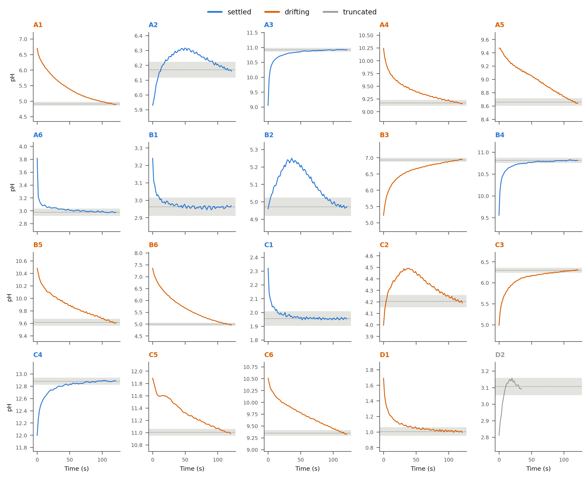

# Rxn Bench pH Experiment 2

**Date:** July 22, 2026

**Personnel:** John Brittain, Felisha Kuo

## Objective

Record the full pH-vs-time settling trace (not just the final stabilized
value) for every well of a 24-well plate, so the traces could be replayed
offline against the endpoint detector (`tune_endpoint.py`) to tune its
stability thresholds against the probe's real settling behavior, rather
than an assumed one.

## Equipment & Materials

- Rxn Bench Gantry
- Atlas Scientific pH probe
- Calibration buffers: pH 4.00, 7.00, 10.00
- Distilled water (rinse)
- `record_ph_traces.py` (client script; see Procedure)

## Procedure

1. Ran a clean 3-point calibration (mid 7.00, low 4.00, high 10.00),
   rinsing the probe between points - same calibration routine as
   Experiment 1.
2. For each well in the 24-well plate, in order: moved to the well,
   engaged the probe, logged a `(t, pH)` sample roughly once per second
   for a fixed recording window, then rinsed at the wash station before
   advancing to the next well. Unlike the earlier experiments, the probe
   was **not** waited-out to a stability criterion first - the entire
   settling curve was captured instead.
3. A first attempt (log `record_ph_traces_20260722_113158.log`) failed
   immediately during calibration with `Must home axis first`, before any
   well was touched, and was restarted.

The recording window landed at roughly 120 s/well in this run (trace
timestamps run from `t=0.0` to `t≈121`), not the script's 300 s default -
this matters for interpreting the results below.

## Results

### Coverage

20 of the 24 wells (`A1`-`A6`, `B1`-`B6`, `C1`-`C6`, `D1`, `D2`) produced a
trace file; `D3`-`D6` were never reached. The second log,
`record_ph_traces_20260722_113315.log`, is 0 bytes, and the last trace
file, `24-well_D2.csv`, ends mid-row in a block of NUL bytes after 34.8 s
of a 120 s window - both point to the run being killed abruptly (not
stopped cleanly) partway through `D2`, rather than finishing or being
paused from the UI.

| Segment | Wells | Notes |
|---|---|---|
| `A1`-`D1` | 19 | Full ~120 s trace recorded |
| `D2` | 1 | Truncated at t≈34.8 s (file ends in NUL bytes) |
| `D3`-`D6` | 0 | Not reached |

### Settling behavior

The chart below (`ph_settling_grid.png`) plots all 20 recorded traces and
classifies each by whether the reading had converged to a stable band by
the end of the ~120 s window (**settled**), was still trending up or down
when recording stopped (**drifting**), or was cut short (**truncated**):



| Outcome | Count | Wells |
|---|---|---|
| Settled | 8 | A2, A3, A6, B1, B2, B4, C1, C4 |
| Drifting | 11 | A1, A4, A5, B3, B5, B6, C2, C3, C5, C6, D1 |
| Truncated | 1 | D2 |

Only 8 of the 20 recorded wells (40%) had actually reached a stable
reading by the time the fixed ~120 s window closed; the other 11 (55%)
were still moving. Several of the drifting traces (A1, A5, B5, B6, C6, D1)
still had a visibly steep slope at the 120 s mark, meaning their true
equilibrium pH was likely well past the value the window happened to stop
on.

### Manual reference grid

`pH_results_manual.xlsx` and its companion plot record a separately
measured pH value for each well, tabulated by well row (columns `A`-`D`)
and well number (rows `1`-`6`). Reproduced as given below - **the exact
correspondence between this grid's row/column headers and the `A1`-`D6`
well labels used elsewhere in this report has not been independently
confirmed, so treat the well mapping as provisional**:

| Well # | A | B | C | D |
|---|---|---|---|---|
| 1 | 1.04 | 1.99 | 2.98 | 4.62 |
| 2 | 4.11 | 5.11 | 5.68 | 6.68 |
| 3 | 6.40 | 7.27 | 8.13 | 10.39 |
| 4 | 12.55 | 12.52 | 10.40 | 8.16 |
| 5 | 7.32 | 9.50 | 6.43 | 5.87 |
| 6 | 5.79 | 5.59 | 4.72 | 2.99 |

These values do not line up closely with the raw ~120 s trace endpoints
recorded above (e.g., taken at face value the grid puts well A1 at pH
1.04, while the `A1` trace was still at pH 4.89 and clearly drifting at
120 s) - consistent with the settling-behavior finding above: many wells
simply hadn't reached the value this reference grid was presumably
measuring toward.

## Discussion

- **Primary finding:** a 120 s recording window is not long enough for
  this probe/toolhead combination - more than half of the recorded wells
  were still drifting when the window closed. Experiment 1's calibration
  buffers alone took 93-156 s to settle, so 120 s was always going to be
  marginal for real samples with less buffering capacity.
- **Abrupt termination:** the run stopped mid-trace on well 17/24 (`D2`)
  with a 0-byte log and a NUL-terminated CSV, which looks like the process
  was killed rather than stopped through the UI's pause/stop handling -
  worth checking whether `check_pause_stop()` was actually reached at that
  point, or whether this was an external kill (terminal closed, machine
  slept, etc.).
- **Manual grid mismatch:** flagged above rather than explained - before
  drawing conclusions from `pH_results_manual.xlsx`, confirm (a) which
  wells its rows/columns actually correspond to, and (b) whether it was
  measured before or after the automated run (sample pH can drift with
  time/CO₂ exposure independent of probe behavior).

## Action Items (Next Experiment)

- Increase the trace/settling window well past 120 s (300 s, the
  script's own default, is a safer starting point) before trusting any
  automated endpoint value against these traces.
- Investigate the mid-run termination so a future long run doesn't lose
  its last several wells silently.
- Confirm and document the `pH_results_manual.xlsx` well mapping before
  using it as ground truth in any future comparison.
- Re-run `tune_endpoint.py` against the 19 complete traces once the
  above is resolved, and record the resulting stability thresholds here.

## Appendix: Raw Console Output

### First attempt (failed at calibration) - `record_ph_traces_20260722_113158.log`

```text
Calibrating probe (3 points) before recording...
Note: the pH probe must be fully submerged and the buffer well-mixed before each reading; increase the buffer volume or engagement depth if it is not.
Clearing any prior calibration...
Traceback (most recent call last):
  ...
sila2.framework.errors.undefined_execution_error.UndefinedExecutionError: HTTPError: 400 Client Error: Must home axis first: 0.000 0.000 134.000 [0.000] for url: http://192.168.10.2:7125/printer/gcode/script

# Exited (1) - 2026-07-22T11:31:59.216984
```

### Second attempt - `record_ph_traces_20260722_113315.log`

Empty (0 bytes) despite 20 wells' worth of trace data landing in
`ph_traces/` between 11:39:09 and 12:36:53 - see Discussion.

### Sample trace (`ph_traces/24-well_A1.csv`, first/last rows)

```text
timestamp,t,ph
2026-07-22T11:39:09.765,0.0,6.702
2026-07-22T11:39:11.402,1.682,6.512
...
2026-07-22T11:41:09.291,119.571,4.899
2026-07-22T11:41:10.928,121.208,4.891
```

Full per-well traces are preserved in `ph_traces/*.csv` (20 files); the
processed settling classification is `ph_settling_grid.png`.
